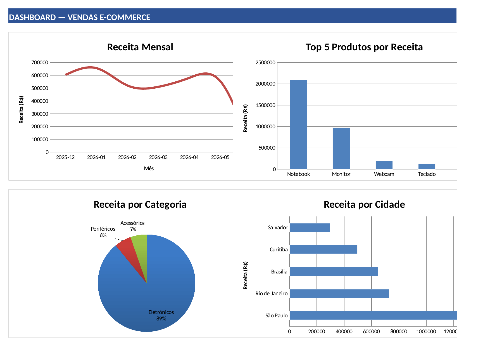
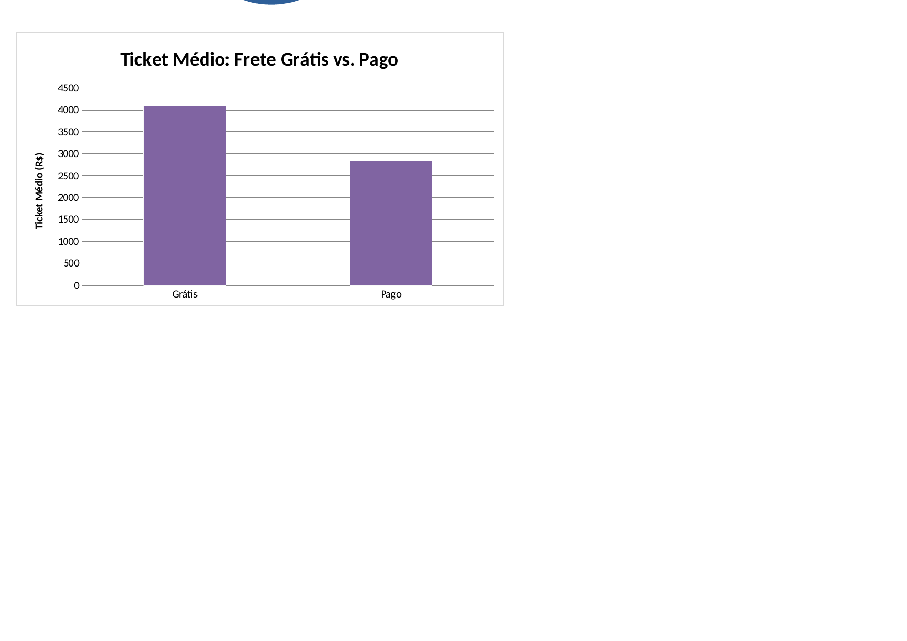

# Análise de Vendas E-commerce — Brasil

Pipeline de dados sintéticos de e-commerce: geração → limpeza → análise → dashboard em Excel e dashboard web interativo.

## Resultado em 30 segundos

**Resumo Executivo** — KPIs principais de um vistazo:


**Dashboard (Excel)** — 5 gráficos ligados às tabelas da aba Análise:




> Estas imagens são capturas reais de `sales_report_FINAL.xlsx`, geradas a partir do arquivo que os scripts deste repositório produzem — não são mockups. Para interagir com o arquivo (filtrar, expandir, copiar dados), baixe `sales_report_FINAL.xlsx` ou rode o pipeline localmente (instruções abaixo).

## Dashboard interativo (web)

Além do Excel, este repositório inclui **`dashboard_interativo.html`** — uma versão web do mesmo dataset, com filtros reais (mês, cidade, categoria, tipo de cliente, frete) que recalculam KPIs e os 5 gráficos no navegador, sobre os 1.000 registros embutidos no próprio arquivo.

- Abra `dashboard_interativo.html` com duplo clique em qualquer navegador (Chrome, Edge, Firefox, Safari) — não precisa de servidor.
- Requer conexão à internet apenas para carregar a biblioteca de gráficos (Chart.js via CDN); os dados em si já estão no arquivo.
- A lógica de agregação foi verificada rodando o JavaScript isoladamente em Node e comparando os resultados filtrados (ex.: São Paulo, frete grátis) com os números de `analise_dados.md` — coincidem exatamente.

## Objetivo

Demonstrar um fluxo completo de análise de dados — gerar uma base sintética realista, processá-la com Pandas e produzir relatórios visuais prontos para apresentação a um público não técnico, tanto em Excel quanto na web.

## Stack

- Python 3.7+
- Pandas — limpeza, agregação e transformação de dados
- openpyxl — geração do Excel (formatação, gráficos)
- HTML/JavaScript + Chart.js — dashboard web interativo

## Estrutura do repositório

```
ecommerce-analysis/
├── README.md
├── requirements.txt
├── analise_dados.md              # Leitura dos insights, com números reais e suas limitações
├── generate_ecommerce_data.py    # Gera 1.000 transações sintéticas -> sales_data.csv
├── process_ecommerce_sales.py    # Limpa, agrega e gera o Excel -> sales_report_FINAL.xlsx
├── sales_report_FINAL.xlsx       # Relatório final em Excel
├── dashboard_interativo.html     # Dashboard web com filtros reais
└── capturas/                     # Screenshots usadas neste README
```


## Como executar

```bash
pip install -r requirements.txt
python generate_ecommerce_data.py      # gera sales_data.csv
python process_ecommerce_sales.py      # gera sales_processed.csv + sales_report_FINAL.xlsx
```

Os dois comandos juntos levam menos de 5 segundos. A data-fim do gerador é fixa (`DATA_FIM = datetime(2026, 6, 1)`, junto com `random.seed(42)`), então rodar o pipeline duas vezes — hoje ou daqui a um ano — produz exatamente os mesmos números. Isso foi verificado comparando o hash MD5 de `sales_data.csv` entre duas execuções separadas.

## Dataset

1.000 transações | 5 produtos | 3 categorias | 5 cidades | 6 meses (dez/2025 a jun/2026)

| Campo | Descrição |
|---|---|
| ID_Pedido | Identificador único do pedido |
| Data | Data da transação |
| Produto | Notebook, Mouse, Teclado, Monitor, Webcam |
| Categoria | Eletrônicos, Acessórios, Periféricos |
| Preco_Unitario | R$ 30 – R$ 6.000, conforme o produto |
| Quantidade | 1 a 5 unidades |
| Cidade | São Paulo, Rio de Janeiro, Curitiba, Brasília, Salvador |
| Tipo_Cliente | Novo ou Recorrente |
| Desconto_Pct | 0%, 5%, 10%, 15% ou 20% |
| Frete | Grátis ou Pago |
| Valor_Bruto / Valor_Final | Valor antes e depois do desconto |

Na aba **Dados** do Excel final, essas mesmas colunas aparecem com cabeçalhos traduzidos para linguagem de negócio (ex.: `Tipo de Cliente`, `% Desconto`) — o CSV bruto mantém os nomes técnicos originais, que é o nome de coluna que o pandas usa internamente nos dois scripts.

## O que o Excel contém

| Aba | Conteúdo |
|---|---|
| Resumo Executivo | KPIs principais: receita total, pedidos, ticket médio, segmentação de clientes |
| Dados | As 1.000 transações, com cabeçalhos em português e formatação de moeda/data |
| Análise | 6 tabelas agregadas: mês, top produtos, categoria, cidade, frete, desconto |
| Dashboard | 5 gráficos ligados diretamente às tabelas da aba Análise |

(Existe uma 5ª aba oculta, `Base dos Gráficos`, usada apenas como fonte técnica dos gráficos — ver comentário no início de `process_ecommerce_sales.py` para entender por quê.)

## Análise de Insights

Ver **`analise_dados.md`** para a leitura detalhada de cada métrica. O documento inclui, de forma deliberada, uma seção sobre **limitações do dataset sintético** — por exemplo, por que a correlação entre frete grátis e ticket médio (+44,1%) reflete uma regra do próprio gerador de dados, e não um comportamento de consumidor comprovado. Essa distinção é intencional: o objetivo não é só apresentar números, mas demonstrar onde uma conclusão é sustentada pelos dados e onde não é.

## Limitações conhecidas (declaradas, não escondidas)

- O dataset é sintético; os valores absolutos não representam uma empresa real.
- Não há identificador único de cliente (apenas o rótulo Novo/Recorrente por pedido), então métricas como LTV ou taxa de recompra individual não podem ser calculadas com este dataset.
- O mês de 2026-06 está incompleto por desenho (a janela de geração termina em 2026-06-01) — visível como queda abrupta no gráfico de receita mensal.
- O período de 6 meses é curto para qualquer afirmação sobre sazonalidade real.

## Skills demonstrados

- **Pandas:** limpeza (`dropna`, `drop_duplicates`), agregação (`groupby`/`agg` com múltiplas funções), validação de dados
- **openpyxl:** formatação profissional (fontes, cores, bordas, formatos de número), gráficos vinculados a dados, controle correto de abas ocultas, configuração de rótulos de dados legíveis
- **Engenharia de software:** funções com responsabilidade única, separação entre lógica de cálculo e lógica de apresentação, estrutura `if __name__ == '__main__':`, dataset reproduzível por construção (sem dependência do relógio do sistema)
- **Front-end:** dashboard web standalone (HTML/CSS/JavaScript) com filtros interativos reais sobre os dados, sem dependência de servidor
- **Comunicação de dados:** tradução de saída técnica para linguagem de negócio, e clareza sobre os limites do que os dados sustentam

## Autor

Jose Perez — Analista de Dados em transição. Stack: Python, SQL, Pandas, Power BI, Excel.
